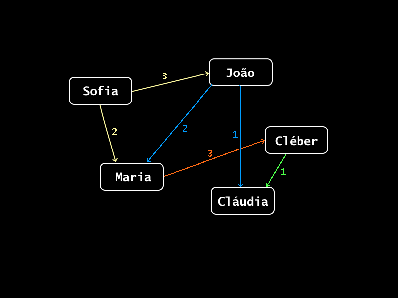

# Grafo_simples
Com base nas aulas 24, 25 e 26 da [playlist de Estruturas de dados em Java](https://www.youtube.com/playlist?list=PLTLAlheiUm5FRR5BNn4iBFwzYHiNq2Iv2) do canal 
[2Guarinos](https://www.youtube.com/@2guarinos) no YouTube, este repositório tem os códigos que representam o Grafo apresentado no tutorial.

---

O Grafo apresentado nos códigos representa as relações numéricas e conexões do mapa a seguir:

<div align="center">
  
</div>

---

Dessa forma, o Grafo é ponderado e direcionado, e para percorrer os elementos e imprimir quais os que pertecem ao Grafo, foi usado o algoritmo 
de busca em largura ([BFS](https://pt.wikipedia.org/wiki/Busca_em_largura)).

Os códigos foram distribuídos em 4 classes:
  - [**```Main```**](Grafos/src/Main.java): classe de execução, que instancia o grafo e cria as manipulações;
  - [**```Grafo```**](Grafos/src/Grafo.java): classe do Grafo, que cria sua estrutura e suas funções, como a de busca em largura;
  - [**```Vertice```**](Grafos/src/Vertice.java): classe que define as características dos vértices criados no Grafo;
  - [**```Aresta```**](Grafos/src/Aresta.java): classe que define as características das arestas criadas no Grafo.

---
A execução da classe Main resulta na impressão dos elementos do Grafo nesta ordem:

```
  Sofia
  Maria
  João
  Cléber
  Cláudia
```

---
É importante citar que este código é apenas um exemplo de implementação que não será executado corretamente se 
os códigos atuais forem modificados sem critério.

A busca feita não possui suporte à erros ou indifições que podem ocorrer em grafos mais complexos, é apenas uma base.

